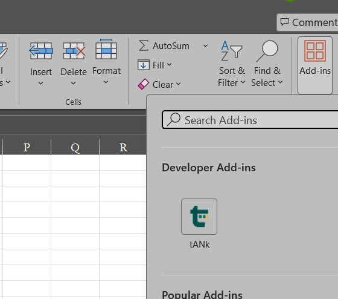

# tANk

An AI chat pane inside Excel, Word and PowerPoint. It reads the file you have open, answers
questions about it, and makes the changes you ask for. It runs on your own API key from any of
nine free providers, so there is no subscription and no account to create.



The **tANk** button sits at the right of the Home tab. Office sometimes takes a restart or two
after installing before it adds the button, so until it shows up, open the pane from
**Home > Add-ins > tANk** instead. Either way the pane opens on the right and stays there
while you work.

## Install

Close Office, download `install.cmd` from [Releases](../../releases) and double click it. No
administrator rights needed. Then open Excel and click **tANk** on the Home tab.

There is a `tANk-Setup.exe` on the same page if you prefer a wizard, though Windows Smart App
Control blocks unsigned installers outright on some machines. The .cmd is not affected.

Full steps, including how to get a free key: [INSTALL.md](INSTALL.md)

## What it can do

### Excel

- Read and edit whatever you select, or find the right range itself
- Write formulas down a column, with references adjusted per row
- Conditional formatting that keeps working: thresholds, duplicates, top N, colour scales, data bars
- Charts, pivot tables, Excel tables, filters, sorting, validation and dropdowns
- Reconcile two ranges by a key column and list what does not match
- Tie out debits against credits and report the difference
- Pick a sample: random, systematic, high value, or monetary unit, with a seed so it is repeatable
- Find duplicates and missing numbers in a voucher or invoice sequence
- Review formulas for errors, hardcoded constants and inconsistent patterns
- Age balances into buckets by date
- Anything else Excel can do, by writing and running a short script

### Word

- Rewrite, tighten or translate the selected text
- Insert headings, paragraphs, lists, tables, footnotes and page breaks
- Find and replace across the document
- Turn track changes on so its edits arrive as revisions you accept or reject
- Read the comments, answer them, resolve them
- Headers, footers, table of contents, document properties, styles

### PowerPoint

- Build slides from a brief, title and bullets at a time
- Read what is on each slide and rewrite it
- Add shapes, text boxes and images, restyle and move them
- Speaker notes

## How to use it

Select some cells or text, type what you want, press Enter.

```
why does this trial balance not tally
add a variance column and flag anything over 10%
reconcile these invoices against sheet Ledger
pick 25 samples by value and put them on a new sheet
tighten this paragraph and keep the meaning
make five slides from these findings
```

If nothing useful is selected it looks at the file and asks where to work. Single cell inside a
block? It suggests the block. **Pin** freezes the scope so it stops following your cursor.

**Before it changes anything** that already has content, it stops and asks. Switch the Edits box to
Auto if you would rather it just went ahead.

**Undo** in the pane header puts back its last change. Excel's own Ctrl+Z will not, because add-in
edits skip Excel's undo history.

**Style** controls how it talks to you: normal, short, or caveman. It never changes what gets
written into your file.

## Keys and limits

Nine providers are built in: Groq, Google Gemini, Mistral, SambaNova, NVIDIA NIM, OpenRouter,
GitHub Models, Z.AI and Cerebras. All have a free tier and only Cerebras asks for a card.

Free tiers cap how much you can send per minute. tANk reads what each provider says it has left
and moves to another model before hitting the wall, then carries on with the same job. Give it two
or three keys and you will rarely notice a limit.

The usage page, the bar chart icon in the header, shows calls, tokens and what each model has left.

## Updates

Settings shows the version and a **Check for updates** button. Leave the daily check ticked and
tANk will look for a new release now and then, and put a dot on the settings button if it finds
one. It only ever looks: nothing downloads or installs unless you go and do it.

## What it touches on your PC

One registry value under your own user account telling Office where the add-in lives, and one
folder in AppData holding the manifest and an icon. Uninstalling removes both. Your API keys sit
in Office's web storage, so clear them with **Erase everything** in Settings before you uninstall.

Installing and removing tANk never touches other add-ins' saved data, and nothing needs
administrator rights.

## Privacy

No server, no account, no telemetry. Keys live in the pane's storage on your machine and go only to
the provider they belong to. Your file is never uploaded; only the cells or text in the current
scope are sent, and only when a question needs them.

## Building it yourself

```bash
npm install
npm run certs      # once, trusts the local HTTPS certificate Office requires
npm start          # Excel
npm run start:word
npm run start:ppt
```

Vite, React and TypeScript on top of the Office JavaScript API.

## Licence

MIT. Shared for learning purposes, with no warranty. Not connected to Microsoft or to any of the AI
providers. Check whatever it writes before relying on it.
